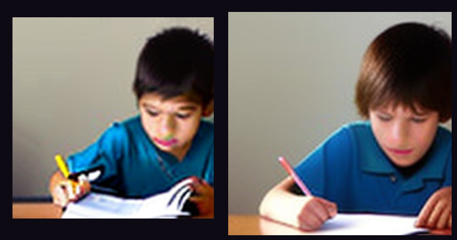

<!-- ABOUT THE PROJECT -->
## About The Project

This is an unofficial implementation of [Training-free Diffusion Model Adaptation for Variable-Sized Text-to-Image Synthesis](http://arxiv.org/abs/2306.08645). Further details can be viewed in the papers

<!-- GETTING STARTED -->

## Samples
|  |
|:--:|
| *A black cat sitting on top of a pot for a plant. [768x768]* |
|  |
| *BMW X5 3.0d Swap or Sell. [768x768]* |
|  |
| *Colorful house against nature background. [1024x1024]* |
|  |
| *Kids doing homeworks. [224x224]* |
|  |
| *A person on Moon. [224x224]* |
|  |
| *A red stop sign that says PARE near a brick intersection. [224x224]* |

## Getting Started

For the ease of installation, you should use [anaconda](https://conda.io/) to setup this repo.

### Installation
```
conda create --name <env> --file req.txt
conda activate <env>
```

<!-- USAGE EXAMPLES -->
### Inference
```
# Usage:
python trainingfreediffuser.py --help

# Example:
## With reweighting scheme
python trainingfreediffuser.py "A black cat sitting on top of a pot for a plant." --wh 768 -n 8 -s 0 -e
## Without reweighting scheme (Normal sampling)
python trainingfreediffuser.py "A black cat sitting on top of a pot for a plant." --wh 768 -n 8 -s 0
```

<!-- ACKNOWLEDGEMENTS -->
## Acknowledgements
This project would not be possible without the generous work from [Stability AI](https://stability.ai/) and HuggingFace